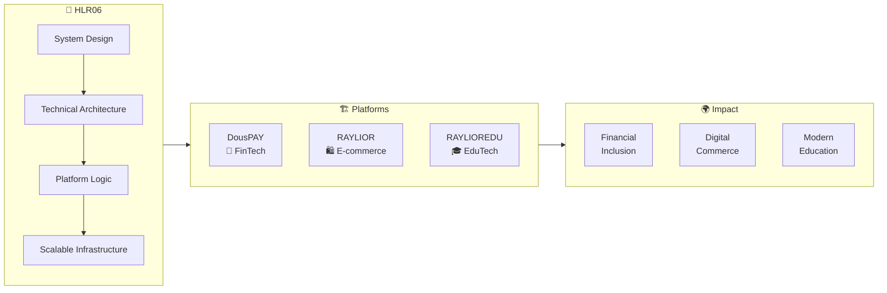
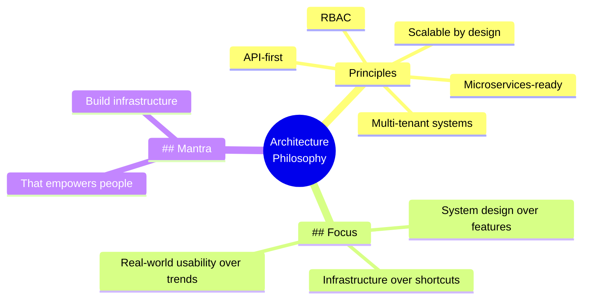

#  HLR06

```

                                                                                   
████████╗██╗  ██╗███████╗     ███████╗  █████╗  ██████╗   ██╗      ███████╗
╚══██╔══╝██║  ██║██╔════╝     ██╔════╝ ██╔══██╗██╔════╝   ██║      ██╔════╝
    ██║   ███████║█████╗       █████╗   ███████║██║   ███╗ ██║      ██████╗
    ██║   ██╔══██║██╔══╝       ██╔══╝   ██╔══██║██║ ██║██║ ██╔      ██ ═══╝
    ██║   ██║  ██║███████╗     ███████╗ ██║  ██║╚██████╔╝  ███████╗ ███████╗
    ╚═╝   ╚═╝  ╚═╝╚══════╝     ╚══════╝ ╚═╝  ╚═╝ ╚═════╝   ╚══════╝ ╚══════╝       
                                                                                 
            System Builder │ FinTech Architect │ EduTech Creator         
                                                                                 

```

> *"Don't just build apps. Build systems that change how people live."*

---

## 🧠 About Me

**Information Systems & Technology Student**  
**System Builder** focused on scalable digital platforms.

I design and build systems that solve real-world problems:

| 💰 Financial Access | 🎓 Digital Education | 🌍 Emerging Tech |
|---------------------|----------------------|------------------|
| FinTech Systems | EduTech Platforms | Global Solutions |

> **Mission:** Build infrastructure that empowers people.

---

## 🌐 Ecosystem Involvement

I contribute to the design, architecture, and development of interconnected platforms.



---

## 💸 DousPAY — FinTech Super App

*A financial ecosystem designed for Haiti and its diaspora.*

### 🎯 Vision & Purpose

| Vision | Purpose |
|--------|---------|
| Enable seamless global transactions | Bridge traditional finance with digital assets |
| Improve financial accessibility | Serve underserved communities |
| Real-time multi-currency operations | Instant, low-cost transfers |

### ⚙️ Core Capabilities

| Feature | Description |
|---------|-------------|
| 🌍 **Cross-border** | Instant global money transfers |
| 💱 **Multi-currency** | USD ↔ HTG ↔ USDT ↔ BTC |
| 💳 **Virtual Cards** | Visa & Mastercard ready |
| 📱 **Mobile Money** | MonCash, NATcash integration |
| 🔐 **Security** | 2FA, biometrics, cold wallets (95% offline) |
| 🏦 **Local Banking** | Unibank, BNC, Sogebank |

### 🧠 My Contribution

| Area | Contribution |
|------|--------------|
| **System Design** | Technical direction & architecture thinking |
| **Feature Logic** | Platform structuring & real-world usability |
| **Scalability** | Focus on growth & performance |

---

## 🛍️ RAYLIOR — E-commerce Platform

*A premium fashion & lifestyle e-commerce experience.*

### 🎯 Vision

Deliver a clean, premium online shopping experience with modern design and global accessibility.

### 🎨 Core Focus

| Area | Description |
|------|-------------|
| 🧩 **UI/UX Structure** | Clean, luxury layout, conversion-focused |
| 🎨 **Brand Identity** | Minimal, elegant, consistent language |
| ⚙️ **Scalable Architecture** | Future-ready, performance-optimized |

### 🧠 My Contribution

- 🎨 Full UI/UX structure design
- 🏷️ Visual identity & layout system
- 🎯 User experience & brand positioning

---

## 🎓 RAYLIOREDU — EduTech Platform

*A multi-institution digital education system.*

### 🎯 Vision

Digitize schools and universities, centralize academic operations, and improve communication.

### 👥 Platform Roles

| Students 👨‍🎓 | Teachers 👩‍🏫 | Parents 👨‍👩‍👦 | Admin 🏫 |
|--------------|---------------|---------------|----------|

### ⚙️ Core Modules

| Module | Description | Status |
|--------|-------------|--------|
| 🎛️ **Dashboard** | Role-based personalized UI | ✅ |
| 📚 **Courses** | Class & schedule management | ✅ |
| 📝 **Assignments** | Creation, submission, tracking | 🔄 |
| 📊 **Grades** | Real-time evaluation system | ✅ |
| 💬 **Messaging** | Multi-role communication | 🔄 |
| 💳 **Payments** | Tuition & financial management | 📅 |
| 🏫 **Institutions** | Multi-school architecture | ✅ |

### 🧠 System Design Focus

| Focus | Description |
|-------|-------------|
| 🏗️ **Multi-tenant** | Multiple institutions, isolated data |
| 🔐 **RBAC** | Granular role-based permissions |
| ⚡ **Scalable** | Microservices-ready architecture |
| 🌐 **API-first** | Designed for integration |

### 🧠 My Contribution

- 🏗️ System architecture & feature design
- 🔧 Platform logic structuring
- 📈 Usability & scalability focus

---

---

## 🧠 Architecture Philosophy

## Principles:
  - Multi-tenant systems
  - Role-Based Access Control (RBAC)
  - API-first architecture
  - Microservices-ready
  - Scalable by design

## Focus:
  - System design over features
  - Infrastructure over shortcuts
  - Real-world usability over trends

## Mantra:
  *"Build infrastructure that empowers people."*




---

## 🛠️ Tech Stack

### Frontend


### Backend


### Database


### DevOps


### Observability


---

## 📊 GitHub Stats

<div align="center">
  
  
</div>

<br/>

<div align="center">
  
</div>

---

## 🏆 GitHub Trophies

<div align="center">
  
</div>

---

## 📈 Roadmap

| Phase | Focus | Status |
|-------|-------|--------|
| 🔹 **Phase 1** | Core System Architecture | ✅ Completed |
| 🔹 **Phase 2** | Feature Development | 🔄 In Progress |
| 🔹 **Phase 3** | User Experience & Optimization | 📅 Planned |
| 🔹 **Phase 4** | Integration & Scaling | 📅 Planned |
| 🔹 **Phase 5** | Expansion & Mobile Systems | 📅 Planned |

---

## 🌱 Currently Learning

| Technology | Focus |
|------------|-------|
| ☸️ **Kubernetes** | EKS, GKE, cluster orchestration |
| 🔐 **Zero-Trust Security** | Modern security architecture |
| 📊 **Observability** | Prometheus + Grafana + Loki stack |
| 🧠 **System Design** | High-scale distributed systems |

---

## 🎯 2026 Goals

- [x] Launch DousPAY MVP
- [ ] Reach 10,000+ users
- [ ] Implement KYC automation
- [ ] Add international remittances
- [ ] Open-source core components
- [ ] Complete RAYLIOREDU MVP
- [ ] Deploy RAYLIOR platform

---

## 📫 Connect

| Platform | Link |
|----------|------|
| 🏢 **Organization** | [@DousPay](https://github.com/DousPay) |
| 👤 **GitHub** | [@HLR06](https://github.com/HLR06) |
| 📧 **Email** | *private* |


---

## 💬 Philosophy
```
┌─────────────────────────────────────────────────────────────────────────────────┐
│                                                                                 │
│   ╔═════════════════════════════════════════════════════════════════════════╗   │
│   ║                                                                         ║   │
│   ║    "Don't just build apps. Build systems that change how people live."  ║   │
│   ║                                                                         ║   │
│   ║                      — HLR06 / System Builder                           ║   │
│   ║                                                                         ║   │
│   ╚═════════════════════════════════════════════════════════════════════════╝   │
│                                                                                 │
│   ┌─────────────────┐ ┌─────────────────┐ ┌─────────────────┐ ┌─────────────────┐│
│   │ 🔧 Scalable     │ │ 🌍 Real-World  │ │ 🎯Technical    │ │ 🤝 Community    ││
│   │   Infrastructure│ │    Impact       │ │    Excellence   │ │    Empowerment  ││
│   └─────────────────┘ └─────────────────┘ └─────────────────┘ └─────────────────┘│
│                                                                                 │
└─────────────────────────────────────────────────────────────────────────────────┘
```

> *"Build for today. Architect for tomorrow. Impact for generations."*

---

```
╔═══════════════════════════════════════════════════════════════════════════════════╗
║                                                                                   ║
║                    "Build infrastructure that empowers people."                   ║
║                                                                                   ║
║                      ⚡ System Builder │ FinTech │ EduTech ⚡                    ║
║                                                                                   ║
╚═══════════════════════════════════════════════════════════════════════════════════╝
```


